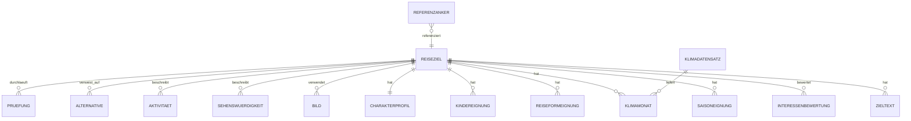

# AP 03 – Datenmodell und Referenzskalen

**Status:** Das logische Modell kann nach AP 01 entstehen; die technische Umsetzung ist bis zum ADR aus AP 02 gesperrt.  
**Verantwortung:** Fachkonzeption verantwortet die Semantik; technische Leitung die Abbildung im gewählten Stack; Redaktion prüft die Pflegefähigkeit; Qualitätssicherung die Validierung.  
**Stories:** US-01, US-03 und US-47; Grundlage für US-02, US-04 bis US-07 sowie US-26 bis US-35.

## Auftrag und Abgrenzung

Dieses Paket liefert ein technologieunabhängiges, versionierbares Datenmodell als verbindlichen Vertrag zwischen Redaktion, Fachlogik und Oberfläche. Es definiert Entitäten, Beziehungen, Wertebereiche, Pflichtfelder, Freigaberegeln und Referenzdaten.

Nicht Teil des Pakets sind ein konkretes Datenbanksystem, migrationsspezifische Syntax, ein Redaktionsfrontend, der Klimaimport oder das Anlegen realer Ziele. Diese folgen erst nach Architekturentscheid beziehungsweise in AP 04 bis AP 06.

## Lieferobjekte

- **ER-Modell**
  - Inhalt: Entitäten, Kardinalitäten und Besitzverhältnisse
  - Abnahmeverantwortung: Technische Leitung

- **Datenlexikon**
  - Inhalt: Feld, Typ, Wertebereich, Pflichtstatus, Quelle und Validierung
  - Abnahmeverantwortung: Fachkonzeption und Redaktion

- **Validierungskatalog**
  - Inhalt: Entwurfs- und Freigaberegeln mit Fehlermeldungserwartung
  - Abnahmeverantwortung: Qualitätssicherung

- **Zustandsautomat**
  - Inhalt: Zulässige Statusübergänge und erforderliche Nachweise
  - Abnahmeverantwortung: Produktverantwortung

- **Referenzdatensatz**
  - Inhalt: gültige und ungültige Beispielobjekte einschließlich Initial-Anker
  - Abnahmeverantwortung: Qualitätssicherung

- **Migrationskonzept**
  - Inhalt: fachliche Versionierung, Rückwärtsverträglichkeit und Umgang mit Schemaänderungen
  - Abnahmeverantwortung: Technische Leitung

## ER-Modell



`ALTERNATIVE` ist gerichtet: Quelle und Ziel sind zwei unterschiedliche Reiseziele. `REFERENZANKER` darf nur auf ein freigegebenes Referenzziel oder auf einen ausdrücklich als Initial-Anker freigegebenen Seed-Datensatz zeigen.

## Datenlexikon und verbindliche Regeln

- **Reiseziel**
  - Pflichtfelder/Beziehungen: `id`, Name, Typ, Region, Land, Ortskennung, Koordinaten, nächster IATA-Code, `prio` 1–5, Preisniveau, Status
  - Kernregeln: Typ ausschließlich `STADT`, `INSEL`, `KUESTENREGION`, `SEENREGION`; ein Land ist kein Reiseziel.

- **Zieltext**
  - Pflichtfelder/Beziehungen: Sprache, Kurzbeschreibung (max. 200 Zeichen), Reisecharakter, Einordnung, Reisedauer, Preisbegründung
  - Kernregeln: Deutsche Fassung ist für die erste Ausbaustufe Pflicht; sprachneutrale Werte liegen nicht im Textobjekt.

- **Interessenbewertung**
  - Pflichtfelder/Beziehungen: Reiseziel, eines von acht Interessen, Wert 0–2
  - Kernregeln: Alle acht Werte sind zu setzen; höchstens drei Interessen haben Wert 2.

- **Saisoneignung**
  - Pflichtfelder/Beziehungen: Reiseziel, Monat 1–12, Wert 0–2, Grund bei 0
  - Kernregeln: Genau zwölf Monate; für Wert 0 ist ein begründender Text Pflicht.

- **Reiseform-/Kindereignung**
  - Pflichtfelder/Beziehungen: Reiseziel, Reiseform bzw. Altersgruppe, Wert 0–2, Begründung
  - Kernregeln: Für jede Reiseform und jede Altersgruppe ist Wert plus Begründung Pflicht.

- **Charakterprofil**
  - Pflichtfelder/Beziehungen: Reiseziel, `trubel`, `kultur_dichte`, `strand_anteil`, `natur_anteil`
  - Kernregeln: Jeder Wert liegt zwischen 1 und 5 und hat einen gültigen Referenzanker.

- **Klimadatensatz/Klimamonat**
  - Pflichtfelder/Beziehungen: Quelle, Referenzperiode, Importstand; je Monat Temperatur, Niederschlag- und Sonnentendenz
  - Kernregeln: Je Ziel genau zwölf vollständige Werte; unvollständige Importe sind nicht freigabefähig.

- **Bild**
  - Pflichtfelder/Beziehungen: Quelle/URL, Urheber, Lizenztyp, Prüfdaten, Zuschnittfreigabe, Alternativtext
  - Kernregeln: Lizenztyp ausschließlich `UNSPLASH`; mindestens ein Bild ist für Freigabe Pflicht.

- **Sehenswürdigkeit/Aktivität**
  - Pflichtfelder/Beziehungen: Titel, Beschreibung, Zielbezug
  - Kernregeln: Beide Inhaltsarten müssen für die Zielseite vorhanden sein; Mindestumfang wird mit AP 05 konkret geprüft.

- **Alternative**
  - Pflichtfelder/Beziehungen: Quellziel, Zielziel, Unterschiedstext, Prüfnachweis
  - Kernregeln: Zwei bis drei freigegebene Alternativen; Unterschied: Profilwert um mindestens 2 oder anderes prägendes Interesse.

- **Prüfung**
  - Pflichtfelder/Beziehungen: Status, prüfende Person, Prüfdatum, Ergebnis, Rückgabegrund
  - Kernregeln: Jeder Freigabe- oder Rückzugswechsel ist nachvollziehbar.

- **Referenzanker**
  - Pflichtfelder/Beziehungen: bewertete Dimension, Skalenwert, Ziel/Seed, Gültigkeit
  - Kernregeln: Jeder Skalenwert 1–5 besitzt vor der regulären Bewertung einen Initial-Anker.

- **Testdaten**
  - Pflichtfelder/Beziehungen: Datensatzkennung, Zweck, Veröffentlichungsflag
  - Kernregeln: Testdaten sind vom öffentlichen Bestand getrennt und nie freigabefähig.

## Zustandsautomat und Freigabe

```text
ENTWURF → IN_PRUEFUNG → FREIGEGEBEN → ZURUECKGEZOGEN
    ↑           │               │              │
    └───────────┘               └──────────────┘
       Rückgabe zur Bearbeitung      erneute Bearbeitung
```

- Nur `FREIGEGEBEN` ist in Suche, Zielseite, Vergleich und Alternativen sichtbar.
- Ein Übergang nach `FREIGEGEBEN` ist nur zulässig, wenn alle oben genannten Pflichtinhalte, vollständige Klimadaten und mindestens ein vollständig lizenziertes Bild vorhanden sind.
- Eine Rückgabe aus `IN_PRUEFUNG` speichert einen Pflichtgrund. Ein Rückzug aus `FREIGEGEBEN` erzeugt eine Korrekturliste für Alternativen und gespeicherte Verweise.
- Initial-Anker werden als gesondertes, geprüftes Seed-Paket freigegeben. Sie sind von der Erstfreigabe öffentlicher Ziele unabhängig; dadurch blockiert das erste Zielpaket nicht zirkulär.

## Konkrete Arbeitsschritte

1. Fachbegriffe aus AP 01 auf Entitäten, Attribute und Wertebereiche abbilden; jede Story-Anforderung im Datenlexikon verlinken.
2. ER-Modell, Datenlexikon und Zustandsautomat mit Redaktion und technischer Leitung prüfen.
3. Den Validierungskatalog für Entwurf, Prüfung, Freigabe, Rückgabe und Rückzug erstellen; Pflichtfelder für die vollständige Zielseite ausdrücklich einschließen.
4. Initial-Anker für alle vier Profildimensionen und Skalenwerte 1–5 als Seed-Datensatz definieren und prüfen.
5. Gültige, unvollständige und absichtlich ungültige Referenzobjekte erstellen; Testdaten als nicht veröffentlichbar kennzeichnen.
6. Migrationskonzept erstellen: Schema-Version, additive Änderung, Datenmigration, Validierung vor Freigabe und Rückkehr auf den letzten gültigen Inhaltsschema-Stand.
7. Nach ADR aus AP 02 das logische Modell ohne Semantikverlust in das konkrete Schema und automatisierte Validierungen überführen.

## Teststrategie

- **Gültiger Stammsatz**
  - Beispiel: vollständig ausgefülltes Ziel mit acht Interessen
  - Erwartetes Ergebnis: Entwurf ist speicherbar und nach Prüfung freigabefähig.

- **Unvollständiger Entwurf**
  - Beispiel: fehlende Preisbegründung oder Aktivität
  - Erwartetes Ergebnis: Entwurf speicherbar, Freigabe mit feldgenauer Fehlermeldung gesperrt.

- **Ungültige Werte**
  - Beispiel: vier prägende Interessen, Saisonwert 3, Land als Zieltyp
  - Erwartetes Ergebnis: Speichern bzw. Validieren wird abgewiesen.

- **Bildrechte**
  - Beispiel: Bild ohne Urheber, Lizenz oder Alternativtext
  - Erwartetes Ergebnis: Freigabe ist gesperrt.

- **Statuswechsel**
  - Beispiel: Freigabe ohne Prüfung; Rückzug eines veröffentlichten Ziels
  - Erwartetes Ergebnis: Ungültiger Wechsel wird abgewiesen; gültiger Rückzug erzeugt Korrekturliste.

- **Referenzanker**
  - Beispiel: Profilwert ohne Anker; Initial-Seed mit vollständigen Ankern
  - Erwartetes Ergebnis: Erster Fall gesperrt, zweiter Fall zulässig.

- **Testdatentrennung**
  - Beispiel: künstlicher Gleichstandsdatensatz
  - Erwartetes Ergebnis: Der Datensatz kann nie in den öffentlichen Status wechseln.

- **Migration**
  - Beispiel: neue optionale Feldversion und ungültige Bestandsdaten
  - Erwartetes Ergebnis: Daten bleiben lesbar; Freigabe erfolgt erst nach erfolgreicher Validierung.

## Risiken

- **R-01 — Struktur wird zu früh technisch festgeschrieben.**
  - EW: 2, AW: 3
  - Gegenmaßnahme: Zuerst logisches Modell; physische Umsetzung erst nach ADR.
  - Eskalation/Abnahme: Technische Leitung bestätigt die verlustfreie Abbildung.

- **R-02 — Pflichtfelder reichen für die Zielseite nicht aus.**
  - EW: 3, AW: 3
  - Gegenmaßnahme: Freigabekatalog gegen US-26 bis US-33 prüfen.
  - Eskalation/Abnahme: Redaktion verweigert Abnahme bei fehlendem Zielseitenblock.

- **R-03 — Erste Profilbewertung blockiert wegen fehlender Anker.**
  - EW: 2, AW: 3
  - Gegenmaßnahme: Initial-Anker als unabhängiges Seed-Paket führen.
  - Eskalation/Abnahme: Keine reguläre Bewertung ohne gültigen Anker.

- **R-04 — Schemaänderungen beschädigen Bestand.**
  - EW: 2, AW: 3
  - Gegenmaßnahme: Versionierung, Validierung und Rückkehrpunkt im Migrationskonzept.
  - Eskalation/Abnahme: Migration ohne erfolgreiches Referenzobjekt nicht freigeben.

- **R-05 — Testdaten gelangen in den öffentlichen Bestand.**
  - EW: 2, AW: 3
  - Gegenmaßnahme: getrennte Kennzeichnung und Freigabesperre.
  - Eskalation/Abnahme: Qualitätssicherung prüft jede Freigabeliste.

## Definition of Done

- ER-Modell, Datenlexikon, Validierungskatalog, Zustandsautomat, Referenzdatensatz und Migrationskonzept liegen versioniert vor.
- Jede relevante Story-Anforderung ist mindestens einer Entität und einer Validierungsregel zugeordnet.
- Alle Testfallgruppen der Teststrategie sind dokumentiert bestanden.
- Die Freigabekette enthält sämtliche Pflichtblöcke der Zielseite und verhindert unvollständige Veröffentlichungen.
- Initial-Anker, Testdatentrennung und Rückzugsverhalten sind fachlich abgenommen.
- Nach dem ADR ist die physische Implementierung gegen das logische Modell geprüft; vorher bleibt dieser Teil sichtbar gesperrt.

**Voraussetzung:** AP 01 für das logische Modell; ADR aus AP 02 für die technische Umsetzung. **Nachfolger:** AP 04, AP 05, AP 06 und AP 07.
